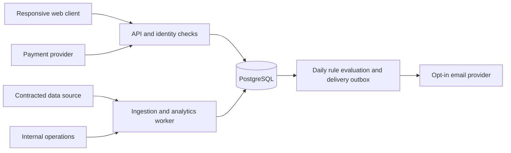

# SwingDesk business implementation plan

Prepared: 2026-09-11. Status: execution proposal, not a deployment or spending commitment.

Reviewed revision: see [Plan risk review](PLAN_RISK_REVIEW.md) for observed code
problems, production gaps and Indian regulatory findings. This revision replaces
the earlier 35-day estimate and 12-week paid-launch assumption. Public deployment
remains conditional on the review's release blockers; documentation changes do
not resolve the code findings.

This is the consolidated plan for turning the current local app into a paid product.
It resolves competing roadmap options for the first release. Existing documents
remain supporting context; delivery notes and code establish what actually exists.

## 1. Business decision

Build a subscription research workspace for self-directed Indian equity investors
who review opportunities after market close and hold positions for days or weeks.

The central promise: **understand unusual activity, inspect the evidence, save your
research rules, and return when those rules match again.**

The first commercial product is a responsive web application with end-of-day data.
Its differentiator is the combination of unusual activity, liquidity, catalysts,
and market context in an understandable evidence view. Screening, watchlists, and
charts make that workflow usable; feature count is not the success measure.

Initial customer hypothesis: an investor who already maintains a watchlist and
uses multiple research tools but struggles to connect scanner results to evidence.
Validate with 15 interviews before increasing scope. This is not established demand.

Planning assumptions pending founder input:

- One technical founder, with limited paid design, legal, and accounting help.
- An internal prototype in twelve weeks remains an ambition; use **18–26 weeks**
  as a provisional solo-founder paid-beta planning range, not a deadline.
- Revised estimate: **62–97 engineering days**, plus approximately 10 business
  days and 15 days of integration/contingency/support. External contracting and
  review can extend this further. Re-estimate after the first complete vertical slice.
- First cohort: 20 invited testers; expand toward 50 only after operational checks.
- India equities only. Publish the exact supported instrument list; start with a
  curated liquid universe of at most 200 symbols if licensed coverage permits.
- Cost figures and prices below are planning inputs, not vendor quotes or forecasts.
- Validate that after-close research over liquid names solves the intended user's
  problem; it does not replace a real-time or rare explosive-move workflow.

A larger team can work on web and backend concurrently after contracts stabilize.
That should improve confidence and testing before it increases feature scope.

## 2. Current assets and launch gaps

| Area | Evidence in this repository | Commercial work still needed |
|---|---|---|
| Research engine | Technicals, fundamentals, liquidity, institutional flow, catalysts, backtesting | Stable contracts, reproducible outputs, data-quality evaluation |
| Research workflows | Named lists, saved numeric screens, exports, comparisons, heatmaps | Per-user ownership, web UI, limits, persistence migration |
| Alerts | Saved conditions checked manually against local daily bars | Scheduled evaluation, event history, delivery, duplicate suppression |
| Portfolio | Groww imports, P&L, risk, paper trading | Account isolation, import validation, descriptive public diagnostics |
| Product shell | Grouped Streamlit navigation, acceptance gate, legal page | Hosted identity, per-user acceptance, billing, support, operational controls |
| Market data | Local SQLite populated by current ingestion connectors | Commercial display/derived-data rights, coverage contract, correction handling |

Existing `research_items` are keyed by kind/name with no user ownership. Existing
settings and portfolio tables are also local-user constructs. Do not expose them
through an authenticated public API without introducing ownership boundaries.

The previous test run recorded two independent failures: a date-sensitive global
news test and a range-anomaly test. Resolve them and establish a clean baseline
before extracting public analytics contracts.

## 3. First paid beta scope

| Surface | Required beta behavior | Acceptance evidence |
|---|---|---|
| Onboarding | Sign in, understand coverage, accept versioned terms, create a watchlist | New user completes the research loop without founder intervention |
| Home | Latest completed data session, watchlist changes, saved-rule activity | Missing/delayed ingestion is visibly distinguished from no matches |
| Discover | Named lists, saved filters, comparison chart/table, CSV export within rights | Objects survive logout; another user cannot read or edit them |
| Scanners | Unusual-activity evidence with liquidity and available catalyst context | Every result has observation time, source provenance, component explanations, and missing-data flags |
| Stock detail | Daily chart, basic indicator overlays, fundamental snapshot, evidence links | Price and fundamental timestamps remain separate; no fabricated history |
| Alerts | Evaluate user rules after a successful daily data batch; in-app history and opt-in email | Replay a completed batch without creating duplicate events or duplicate queued deliveries |
| Account | Access limits, paid access, expiry, receipts, support, data export/deletion request | Payment state reconciles with provider; expiry does not delete user research |

All public surfaces must also pass the app-state and accessibility criteria in
the risk review: loading, no matches, missing/stale data, errors, expired sessions,
payment pending and quota exhaustion; usable keyboard controls and narrow-screen
layouts; visible units and a chart data-table alternative. Same-name overwrites,
multi-tab edit conflicts, and saved-universe changes require deliberate controls.

Reuse comparison as a simple chart/table. The existing heatmap can follow in beta
polish if capacity remains; it is not a launch dependency.

Portfolio import and risk diagnostics are the first post-beta extension. Keep the
Portfolio navigation entry out of the customer release until that flow is ready.
Likewise, Lab becomes public only after historical-data quality and backtest
validation meet the criteria below. The five-section architecture remains the
destination, not a reason to ship empty sections.

Public beta excludes personalized allocation actions, automated execution, native
mobile apps, real-time ticks, options, mutual funds, broker account linking, public
strategy sharing, Pine compatibility, and conversational stock recommendations.
Existing internal tools may remain available locally; customers get an explicit
allowlist of reviewed routes and outputs.

## 4. Product behavior and evidence

Main journey:

```text
Sign in → choose covered symbols → save screen → inspect matching evidence
        → save alert rule → receive opt-in daily update → revisit saved research
```

An evidence card must answer: what changed, relative to which baseline, when the
data was observed, what corroborates it, what is missing, and what can invalidate
the interpretation. Call the feature unusual activity; do not present a heuristic
score as proof that an issuer or investor manipulated a market.

Do not simply rename an existing BUY/SELL recommendation and publish the same
instruction underneath it. Public output schemas should expose observations and
user-rule results; remove personalized action amounts, replacement suggestions,
and prescriptive summaries. Historical transaction sides such as a disclosed BUY
or SELL remain factual records and should not be removed by a blanket text replace.

Scanner validation must include split/bonus adjustments, suspended symbols, zero
volume, stale and missing bars, and illiquid-name outliers. Record formula versions.
Public backtests additionally require documented costs, leakage checks, historical
universe limitations, and out-of-sample evaluation. No win-rate or predicted-move
claim enters launch marketing without a reviewed and reproducible basis.

## 5. Packaging and pricing hypothesis

Use Free and Pro at launch. Postpone the Trader/Edge plan until intraday capability
and its data costs are known. These limits are proposed business rules to validate.

| Capability | Free | Pro beta |
|---|---|---|
| Watchlists | 1, up to 20 symbols | 10, up to 100 symbols each within covered universe |
| Saved screens | 2 | 20 |
| Scanner evidence | Limited daily sample with complete evidence | All covered results |
| Active alert rules | 2, at most 40 active rule-symbol slots total | 25, at most 500 active rule-symbol slots total |
| Delivery | In-app daily results | In-app plus opt-in daily email digest |
| Comparison | 2 symbols | 6 symbols |
| CSV export | User-owned settings/data | Research results where provider contract permits |
| Backtests and portfolio | Not promised at beta | Not promised at beta; separately announced later |

A rule-symbol slot is one enabled rule applied to one member of its saved universe.
Count overlapping symbols separately across different rules. Show projected usage
before saving; reject an over-limit change without modifying the saved object.
Do not silently skip excess symbols. Reserve capacity transactionally. A replay
does not consume another customer slot; operational retry budgets are separate.
When access expires, let the customer select rules to retain within Free limits;
otherwise pause all paid-only rules with explicit status and a notification.

Working price: **₹2,999 for one year**, sold as prepaid access with manual renewal
for the initial beta. No automatic renewal promise. Price displayed at checkout
must state the total payable and applicable tax treatment established with the
accountant. The financial illustration below uses revenue net of indirect taxes.

The older blueprint proposed ₹4,999/year; the business-model document proposed
₹2,999/year, ₹299/month, and a ₹1,999 launch offer. Resolve this by testing ₹2,999
and ₹4,999 with prospective users, then choosing one published price before paid
beta. Do not quietly run inconsistent prices across checkout and marketing.
No default ₹1,999 discount or monthly plan in the implementation baseline.

Implement limits on the server, including concurrent requests and background jobs.
Free customers can always export their own account data and request deletion.
Downgrades pause excess rules and disable new over-limit writes while retaining
saved research according to the published retention policy.

## 6. Economics and budget decision

The ₹2,999 checkout hypothesis must not automatically become ₹2,999 net revenue.
If the chosen displayed price includes applicable indirect tax, calculate net
revenue as `checkout_price / (1 + applicable_tax_rate)` before the model below.
Confirm classification, registration and rate with the accountant. The table below
assumes ₹2,999 net revenue and must be recalculated if that is not the actual result.

Model net revenue, cash, and contribution separately. Annual cash received is not
one month's recurring revenue. Vendor minimums, salaries, acquisition spending,
and launch legal costs must all appear in the cash plan.

Illustrative model, not observed economics:

```text
Annual net subscription revenue P = ₹2,999
Monthly revenue equivalent R = P / 12 = ₹249.92
Payment/refund/collection leakage assumption = 8% of R
Variable serving cost assumption = ₹35 per paid user/month
Contribution C = R × 0.92 − 35 = ₹194.92 per paid user/month
Break-even paid users = ceiling(total fixed monthly cost / C)
```

| Fixed monthly cost scenario | Paid users at illustrative break-even |
|---|---:|
| ₹30,000 | 154 |
| ₹80,000 | 411 |
| ₹1,50,000 | 770 |

Fixed cost must include data minimums, infrastructure, free-user load, support,
salaries/founder compensation if included, and ongoing operations. The ₹35 estimate
must include any per-subscriber data cost; replace it when quotes arrive. The 8%
allowance is not a payment-provider fee quote. If contribution is zero or negative,
the price/coverage/serving model must change before selling subscriptions.

Before spending, collect a worksheet with exact monthly/annual commitments for
data, hosting/database/backups, identity/email, payments, legal/accounting, design,
and acquisition. Add one-time setup costs and a contingency reserve; model cash
at 0, 50, 200, and 500 paid users for six months. Budget remains founder-set.

Growth guardrail hypothesis: acquisition payback under six months of contribution
after measured retention. At the illustrative contribution that caps CAC near
₹1,170, before a safety margin. Track founder acquisition hours separately rather
than treating them as free. Do not justify spend using an unmeasured lifetime value.

## 7. Delivery architecture

Use one modular Python backend, one worker, a responsive web client, and managed
PostgreSQL. Keep the Streamlit app as the internal research interface. This is a
smaller first deployment of the layers in `PRODUCTION_ARCHITECTURE.md`.



Proposed code layout:

```text
swingdesk/               existing analytical engine and local app
backend/swingdesk_api/   routes, ownership, contracts, billing, repositories
backend/workers/         ingestion, snapshots, rule evaluation, delivery
clients/web/             responsive customer interface
migrations/              versioned PostgreSQL migrations
tests/                   engine plus API, migration, job, and user-flow tests
```

Choose FastAPI to keep engine integration in Python and a Next.js client consistent
with the existing web direction. Hosting choice and package versions are pinned
in the implementation ADR after current maintenance and cost checks. Both projects
document deployment options; these are design choices, not benchmark claims.
[FastAPI deployment](https://fastapi.tiangolo.com/deployment/concepts/),
[Next.js deployment](https://nextjs.org/docs/app/getting-started/deploying).

Use `backend/` rather than a top-level Python package named `platform`, which can
collide with Python's standard-library module. Begin with PostgreSQL-backed jobs
and an outbox; add Redis only if measured caching/queue needs justify it. Kafka,
a separate time-series database, microservices, and streaming gateways are later
capacity choices, not beta prerequisites.

Public analytics read versioned snapshots; HTTP requests do not trigger a full
market recomputation. Worker concurrency and per-account job budgets are explicit.
Separate development, staging, and production credentials and data. Private
portfolios and watchlists must never enter globally shared response caches.

## 8. Ownership, migration, and API contracts

Shared market records: instruments with stable IDs and symbol history, daily bars,
fundamental observations, source/ingestion batches, and scanner snapshots.

User-owned records: users, watchlists/members, screens with schema versions, alert
rules/versions/events, delivery preferences, acceptance records, access grants,
payment records, exports, and audit events. Portfolio accounts/imports are next-phase
tables. Use immutable object IDs; names are unique only within an owner's namespace.

Read/write repositories require owner identity derived from the authenticated
session. Never trust `user_id` supplied in a body. Test ownership for reads, writes,
deletes, exports, background jobs, and administrative access. Administrative actions
need separate privileges and an audit record.

Initial route families: `/v1/me`, `/v1/watchlists`, `/v1/screens`, `/v1/instruments`,
`/v1/scanner-results`, `/v1/alerts`, `/v1/alert-events`, `/v1/access`, and payment
webhooks. Responses carry `as_of`, `source`, `formula_version`, coverage flags,
pagination, and units where applicable. Filter contracts use supported operators
and typed values; never evaluate submitted Python or SQL.

Migration sequence:

1. Back up and checksum the founder's SQLite data; verify that backup opens.
2. Create versioned PostgreSQL schema and an explicit founder account.
3. Import selected local research objects into that account, preserving existing
   saved universe semantics and recording an idempotent import identifier.
4. Load only market history with permitted production usage; retain provenance.
5. Compare counts and representative calculations on the same frozen data batch.
6. Switch staging to the new store, test rollback, then prepare production cutover.

The local app remains usable independently. Do not silently upload private holdings
or turn every global research object into data shared among all users.

## 9. Reliable daily alerts and payments

Data-batch states: pending → validating → complete, or failed/quarantined. Rules
evaluate only complete batches. Use an exchange-session calendar, not the local
prototype's four-calendar-day freshness approximation.

Preserve raw bars, adjustment factors, observation/availability times and correction
versions. Publish an immutable batch reference atomically. Validate missing sessions
before calling a change a one-session return. Workers use leases, retry limits,
unique event keys and a failed-job queue; rehearse crashes at transaction boundaries.

Each rule has owner, universe snapshot, formula version, conditions, enabled state,
and notification preferences. Beta semantics: at most one matching event per rule,
symbol, and completed market session. A condition can match again the next session;
crossing-only alerts are a separate future feature. Missing data produces an
explicit skipped status, not a false negative or an alert.

Commit events and notification outbox rows transactionally. Retry with a stable
delivery key, record provider responses, and surface failures. Promise one logical
event per session, not exactly-once external email delivery. Allow pause/unsubscribe.
Late corrections recompute affected evidence and carry correction metadata without
silently sending a second initial alert.

Pin rule, universe, formula and source versions at scheduling. Same-session rule
edits take effect next session by default; manual previews create no notifications.
Corrections link to the original event and expose changed/retracted evidence.

For paid access, start with hosted checkout for prepaid annual access. Grant access
only after verified provider payment state; never from a browser redirect alone.
Record provider event IDs, handle repeated/out-of-order events, reconcile missed
events, and test refunds, disputes, access expiry, and receipt delivery. Razorpay
documents signature validation and duplicate/out-of-order webhook handling; actual
merchant approval, fees, and payment-method availability remain to be confirmed.
[Webhook validation](https://razorpay.com/docs/webhooks/validate-test/?preferred-country=US).

Provider records alone do not reconstruct a lost account/order mapping. Keep an
immutable internal ledger of account, order, provider payment, price, currency,
access period and refund state. Test restoration across a payment and refund,
reconcile to a provider watermark, then resume entitlement writes.

## 10. Data, product review, and customer operations

Start data-provider and product-scope reviews in week 1 because they can change
coverage, pricing, and public behavior. This is a launch dependency from the existing
business plan, not a reason to stop local engineering or make blanket legal claims.

NSE's published policy makes intended use and redistribution subject to agreement.
Confirm contractual rights for commercial display, historical storage, calculated
outputs, charts, exports, alerts, and end-user counts. End-of-day data still needs
appropriate rights. Apply a separate source review to BSE, fundamentals, and news;
public URLs and successful scraping are not evidence of redistribution permission.
[NSE data policy](https://www.nseindia.com/static/market-data/nse-data-policy).

The intended posture remains analytics-only. Obtain review of actual screens,
scoring, personalisation, claims, and customer terms rather than assuming a disclaimer
or descriptive label establishes an exemption. SEBI published a Research Analysts
Master Circular on 6 February 2026; it is a relevant review input, not a determination
that SwingDesk needs or does not need registration.
[SEBI circular](https://www.sebi.gov.in/legal/master-circulars/feb-2026/master-circular-for-research-analysts_99571.html).

Founder/legal/accounting work products before charging customers: appropriate
business/merchant setup, invoicing/tax treatment, customer terms, privacy and
retention policy, refund policy, support contact, provider agreements, and a record
of the public-feature review. Confirm current obligations with the relevant adviser.
Product analytics should exclude holdings contents and uploaded broker files.

Operations owner is the founder with a named backup in beta. Provide a next-business-day ordinary support target,
an ingestion-status panel, a stale-data incident procedure, and a way to disable
rules or a faulty scanner centrally. Log errors without secrets or private CSVs.
Run encrypted backups and demonstrate restore before beta; targets are recovery
within four hours and at most 24 hours of lost non-payment data. Reconcile payments
from provider records and durable account/order mappings after recovery. Security
incident handling is a separate monitored process with the applicable CERT-In
reporting clock and log-location/retention duties, not next-business-day support.

Before the first account rollout, complete processor, data-location, purpose and
retention inventories. Reconcile erasure requests with required transaction/log
retention; propagate eligible deletion to processors, caches and queued jobs, and
replay deletion markers after recovery. The regulatory effective-date calendar in
the risk review covers DPDP phases and announced January 2027 consumer changes.
Confirm current texts/applicability before release; do not claim every DPDP duty is
already operative or that an educational disclaimer permits recent-price outputs.

## 11. Revised milestone plan

Weeks are indicative windows relative to an agreed start, not promised launch dates.
The final hardening window overlaps earlier completion where possible. Data or
review delays keep work internal with permitted test data and move external exposure.

| Window | Engineering outcome | Business outcome | Exit condition |
|---|---|---|---|
| Weeks 1–3 | Baseline, calendar/adjustment contract, public-output allowlist, API/schema ADR | Customer interviews, data quotes and substantive scope review | Actual hero workflow and feasible rights/cost route; initial estimate revised |
| Weeks 4–8 | Identity, ownership, privacy lifecycle, migrations, web shell | Draft customer policies and processor agreements | Account-isolation and lifecycle tests pass |
| Weeks 9–12 | Saved screens, scanner evidence, accessible states, stock detail | Observe five sessions on synthetic or permitted data; price tests | Core workflow understandable including no-match/stale states |
| Weeks 13–16 | Batch jobs, versioned alerts, outbox and delivery controls | External beta only after applicable source/product gates pass | Replay, correction and worker-crash cases pass |
| Weeks 17–20 | Verified checkout, quotas, durable ledger, support instrumentation | Publish chosen price and retention/refund/support commitments | Billing/lifecycle acceptance tests and operational readiness |
| Weeks 18–26, as gates permit | Hardening, independent security review, restore/load rehearsals | Small paid beta and retention measurement | All release gates pass; extend internal testing if they do not |

If revised estimates exceed capacity, move comparison polish and custom digest
formatting first; move payment launch later if necessary. Never cut isolation,
freshness handling, verified billing, or required data permissions to meet a date.

## 12. Ordered implementation backlog

Effort is a review estimate in engineering days, not a commitment. The revised
total is 62–97 days, excluding business work and the additional contingency reserve.
It assumes one bounded source integration and managed identity/payment services;
a different regulated operating model requires its own estimate.

| ID | Deliverable | Depends on | Days | Done when |
|---|---|---|---:|---|
| B01 | Fix recorded test failures and freeze deterministic fixtures | — | 2–3 | Full baseline passes without live feeds |
| B02 | Public DTOs and substantive route/output review | B01 | 3–5 | Prescriptive fields excluded; actual scanner semantics reviewed |
| B03 | Calendar, corporate actions, immutable batches and bounded source adapter | B01 | 6–10 | Gaps, corrections and historical availability tested |
| B04 | API, managed identity, session/owner security and migrations | B02 | 8–12 | Abuse tests and migration recovery pass |
| B05 | Accessible onboarding, watchlists, saved screens and conflict handling | B04, B12 | 7–10 | CRUD, error states, revision conflicts and limits pass |
| B06 | Scanner/evidence contracts, stock detail and bounded comparison | B03, B05 | 6–10 | Frozen-batch parity, units and missing-data states verified |
| B07 | Leased jobs, versioned events, outbox and correction behavior | B03, B04 | 5–8 | Crash, retry, edit and replay tests pass |
| B08 | Event history, digest, preferences and delivery recovery | B05, B07 | 3–5 | Unsubscribe and failed delivery handled |
| B09 | Prepaid checkout, durable account/payment ledger and quota enforcement | B04, chosen price | 5–8 | Duplicate/refund/expiry/restore cases pass |
| B10 | Incident/support operations, observability, retention and restore | B05–B09, B12 | 7–10 | Reporting/restore drills and processor controls pass |
| B11 | Independent security review, load/regression testing and fixes | B01–B10, B12 | 5–8 | All technical launch criteria pass |
| B12 | Privacy/acceptance lifecycle, processor inventory and deletion propagation | B04 design | 5–8 | Account deletion, legal retention and restore tombstones verified |

Founder owns prioritisation, interviews, provider contracting and release decisions;
technical founder owns B01–B12 unless people are explicitly assigned. Design and
professional review are separately budgeted engagements, not assumed team members.

## 13. Paid-beta and growth gates

Paid beta requires all of the following evidence:

- Production sources permit the intended commercial usage; defined scope and
  customer-facing claims have completed the planned review.
- Apply the relevant source/feature-review gate before any external demo or free
  beta, not only at payment launch. Educational use has its own data restrictions.
- No known cross-account access paths or critical account/payment defects.
- At least 95% valid daily price coverage in the advertised universe on each of
  ten consecutive exchange sessions. Fundamental coverage is separately disclosed.
- Ingestion completion meets the chosen provider's contractual schedule; if it
  misses, customers see stale status and affected alert evaluations are skipped.
- At least 99% of valid enabled rule-symbol pairs evaluated within 30 minutes of
  an accepted batch during the ten-session rehearsal; no duplicate logical events.
- Publish expected pairs, valid pairs, evaluated pairs and skipped pairs separately,
  including per-account impact. Every skip has a reason; no denominator silently
  drops failures. No return calculation uses an unflagged missing session.
- Core page p95 response under two seconds for 20 concurrent test users on the
  reference universe, excluding asynchronous jobs and external email delivery.
- Payment, data-export/deletion, backup restore, and support drills pass.
- Session/recovery, account-isolation, processor deletion and reporting-clock drills
  pass; date-specific consumer/privacy obligations are mapped to release dates.
- At least 10 of 20 invited testers complete the activation workflow, and at least
  five independently express willingness to pay the proposed published price.

The performance targets are internal acceptance goals to measure, not present SLAs.

Define activation as saving a non-empty covered watchlist and a rule, running the
screen, and viewing an evaluated outcome and data timestamps within seven days;
zero matches can qualify. Track evidence engagement separately. Define a meaningful weekly research action
as viewing evidence, running a saved screen, or reviewing an alert event.

Instrument `signup_completed`, `watchlist_saved`, `screen_saved`, `screen_run`,
`evidence_opened`, `alert_created`, `alert_event_viewed`, `checkout_started`,
`payment_verified`, and `access_expired`. Use consent-appropriate pseudonymous IDs,
schema versions, and timestamps; do not send raw holdings to analytics tools.

Provisional expansion targets: at least 40% of activated beta users perform a
meaningful action in week 4; at least five users pay without a special discount;
positive measured contribution per paid user; stable freshness and support load.
Small cohorts are directional evidence, so publish denominators and cohort dates.
If retention misses, improve comprehension and repeat use before buying traffic.

## 14. Acquisition and subsequent releases

First cohort: founder-led interviews and a short evidence-workflow demo. Recruit
through permission-based communities and educator relationships; no outbound
messages or campaigns have been sent as part of this plan.

Publish educational examples showing how to inspect liquidity, unusual activity,
and missing evidence. Use sample or appropriately licensed data. The call to action
is to build a personal screen. Attribution tracks qualified visits → activation →
week-4 use → payment, not impressions alone.

After beta: add portfolio diagnostics and supported CSV imports, scanner history,
guided screen templates, and carefully validated Lab workflows. After recurring
use and sustainable costs: mobile-friendly alert improvements, broader licensed
coverage, then an intraday tier. Native apps and broker sync depend on demonstrated
demand, stable APIs, permissions, and an operating budget.

Prepare fundraising materials once the demo, real cohort metrics, cost model,
review record and customer evidence exist. Use the existing fundraising roadmap
for the deck/data room; no invented traction or guaranteed return claims.

## 15. Decisions still awaiting evidence

| Decision | Working default | Evidence required | Deadline |
|---|---|---|---|
| Staffing and calendar | Solo founder, provisional 18–26-week paid-beta range | Founder capacity, reviewed estimates and budget | Before committing delivery dates |
| Data source and covered universe | Contracted daily equities, up to 200 symbols | Rights, coverage, corporate actions, freshness, total quote | Week 2 feasibility; contract before external use |
| Published price | ₹2,999/year prepaid | Interviews and contribution model; compare ₹4,999 | Before checkout implementation is final |
| Infrastructure/identity/email vendors | Managed services, one region to start | Cost, recovery, data handling and operational review | B04 design |
| Public legal posture | Analytics-only intended scope | Review of actual product and applicable rules | Before paid/public release |
| Launch budget | Unset | Six-month cash model and founder limit | Before provider commitments |

These are explicit assumptions for the plan; they do not block local B01/B02 work.
The next implementation task is to stabilize the existing tests and define the
public analytics contracts, then build account-owned watchlists as the first
complete web/API/database slice.
